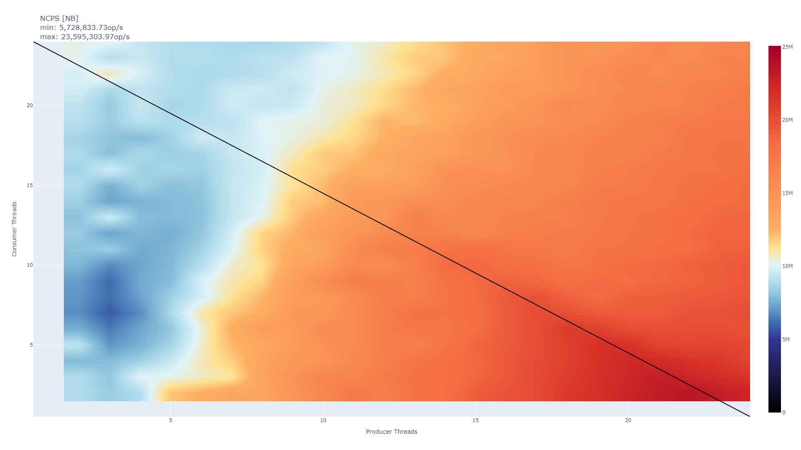
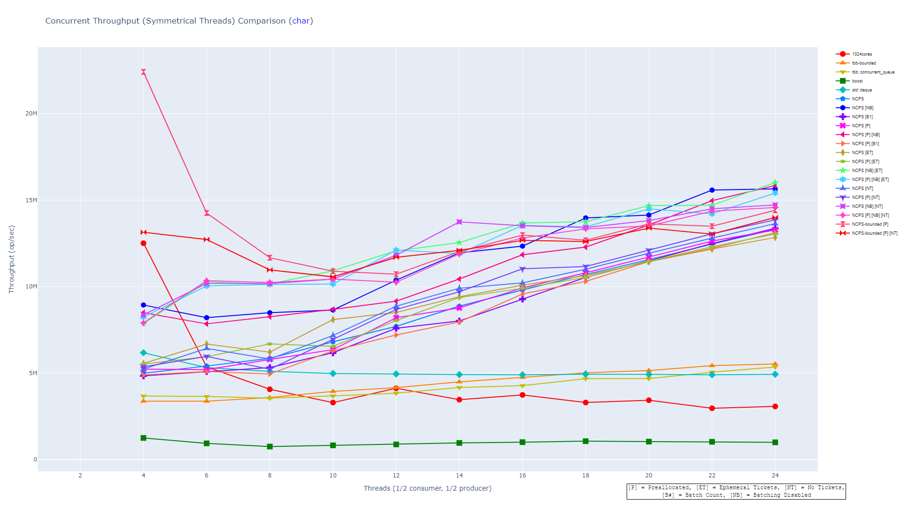
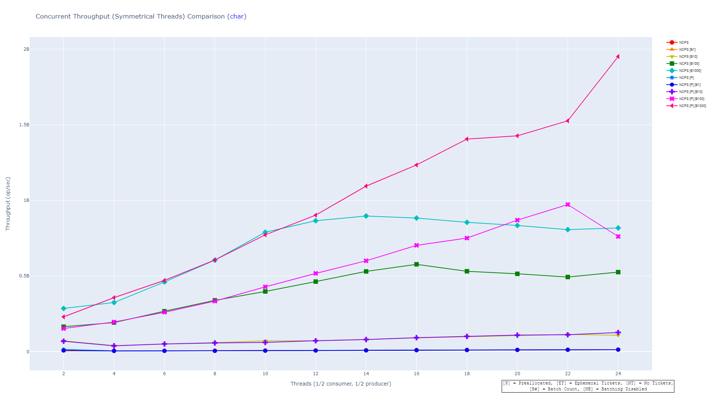
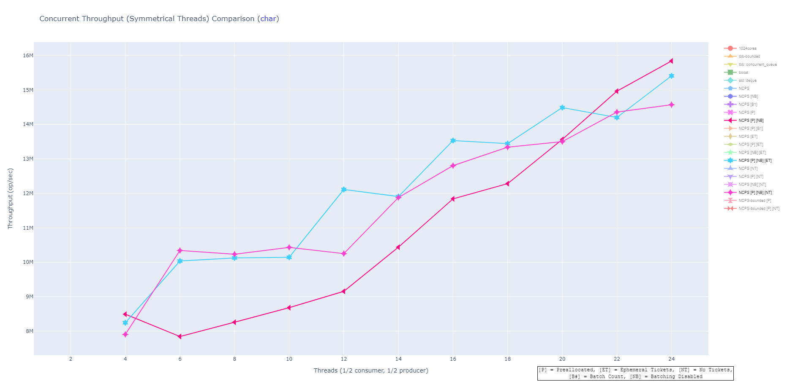
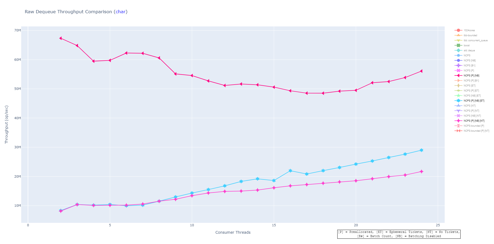
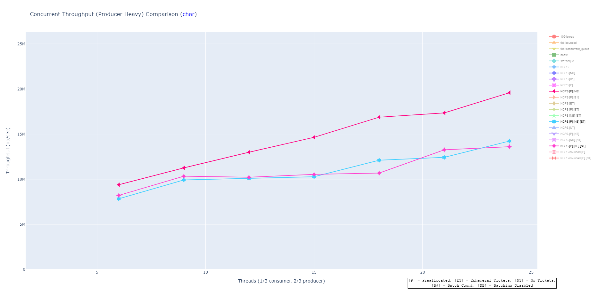
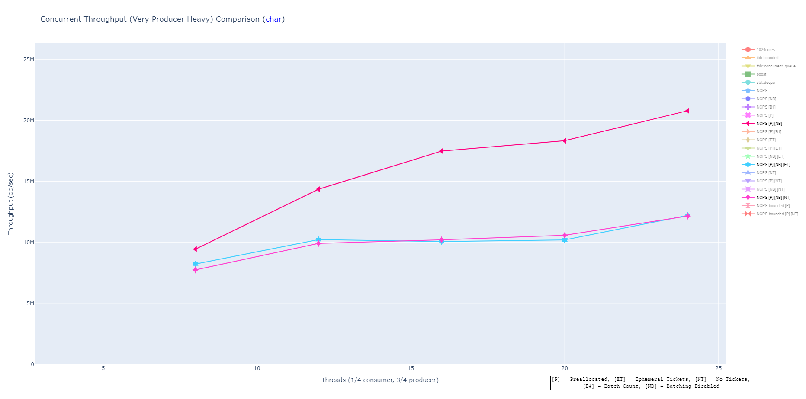
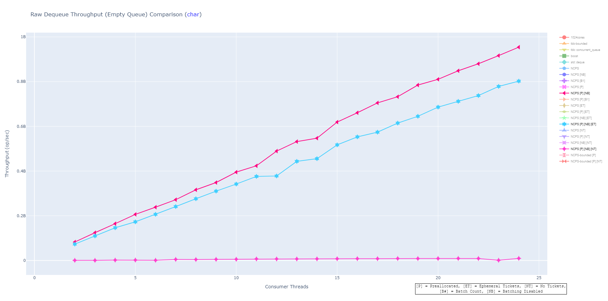

# NCPSQueue

[NCPSQueue](#ncpsqueue)
	[Scaling](#scaling)
	[Batch Enqueues and Dequeues](#batch-enqueues-and-dequeues)
	[Bounded vs Unbounded](#bounded-vs-unbounded)
	[Memory usage](#memory-usage)
	[Reservation Tickets](#reservation-tickets)
	[Ticket-Free API](#ticket-free-api)
	[Benchmarks](#benchmarks)
		[Testing Methodology](#testing-methodology)
		[Results](#results)
		[A Note on Scale](#a-note-on-scale)
		[Graph Suffixes](#graph-suffixes)
		[Interpretation](#interpretation)
			[Plateau in Batch Mode](#plateau-in-batch-mode)
			[Ephemeral vs Persistent Tickets vs No Tickets](#ephemeral-vs-persistent-tickets-vs-no-tickets)
			[Shape of the Heatmap](#shape-of-the-heatmap)
	[Unit Testing](#unit-testing)

`NCPS::ConcurrentQueue` is a generic queue that comes in both bounded and non-bounded formats, and uses the concept of a ReservationTicket to provide wait-free performance in >99.987% of cases with the unbounded queue (a spin-lock must be taken when the queue needs to resize, which happens once per N enqueues, where N is a configurable bucket size - by default, 8192) and in 100% of cases with the bounded queue. A ticket-free API is also provided that offers a trade-off between usability and performance - the lock-free API reduces the concurrency guarantee to only lock-free, particularly when dequeueing from an empty queue.

`NCPS::ConcurrentQueue` is implemented using contiguous memory, creating optimal cache coherency (excepting false-sharing situations where cache coherency is not available). Dynamic memory allocation is only used in the unbounded queue when it runs out of space and needs to resize; in the bounded queue, dynamic memory allocation is never performed.

Additionally, `NCPS::ConcurrentQueue` provides the unique capability to do batched enqueues and dequeues in the unbounded queue. Batching can offer extreme performance improvements, as each batch only has to perform 2-3 atomic operations for the whole batch. Taking advantage of large batches unlocks limitless positive scaling across multiple threads, as you'll see from the benchmarks below.

`NCPS::ConcurrentQueue` is also implemented in terms of only atomic increments and decrements - meaning it uses zero "compare and swap" operations, which is what enables its wait-free performance. (In the unbounded case, the enqueue operation also includes an "exchange" operation when resizing to form a spin-lock to ensure safe reallocation - again, this happens only once per N enqueues.)

## Scaling

As indicated by the name (N-Core Positive Scaling Concurrent Queue), `NCPS::ConcurrentQueue` has a unique property among popular concurrent queue implementations in that it is capable of scaling positively as more cores are added. Other tested implementations achieve flat performance or extremely slight growth with more cores - the overall system throughput doesn't change as more cores are added, but instead, the throughput just gets spread out as each thread individually performs slower due to the extra activity in the system resulting in contention on the shared variables. `NCPS::ConcurrentQueue`, like most queues, operates at its fastest total system throughput in the single-producer, single-consumer case; however, unlike other tested implementations, the overall throughput of the system increases as more cores are added. (Though it takes a large number of cores in the multi-producer and/or multi-consumer cases to reach the throughput of the single-producer/single-consumer case.)

Note that the following benchmark images (and all images in the `NCPS_Unbatched_Vs_Others` benchmarks) exclude the single-producer and single-consumer cases, in order to highlight the scaling properties, which are more difficult to see when those cases are included as the low contention makes them many times faster. This is true for `NCPS::ConcurrentQueue` as well as all other tested implementations. For the curious, however, the single-producer and single-consumer cases are included in the `WithSingles` subdirectory of `NCPS_Unbatched_Vs_Others`.

## Batch Enqueues and Dequeues

As mentioned above, `NCPS::ConcurrentQueue` supports batched enqueues and dequeues, allowing for much faster operations by reserving or reading from multiple positions in the queue in only 2-3 atomic operations. 

It's hard to overstate the significance of the performance advantage of this. This graph shows a comparison of various batch sizes to unbatched operations in NCPS - take note of the difference in scale from the above graph - the blue line at the bottom of this graph shows the same values as the matching blue line in the graph above. With 24 total threads, batch enqueues and dequeues with a batch size of 1,000 achieve a throughput 35,316.55% faster than the best non-NCPS implementation (TBB bounded).

However, do note that a batch size of 1, while still outperforming other tested implementations, is the **slowest** mechanism for interacting with the `NCPS` queues, and just having batch mode enabled adds a small cost to the regular single enqueue and dequeue operations, so it's best to turn it off if you're not using it.

## Bounded vs Unbounded

In practice, the unbounded queue actually tends to be faster than the bounded queue because enqueuing to the unbounded queue can never fail, meaning there are fewer edge cases it has to consider. Additionally, the bounded queue currently does not support batch processing, specifically due to the question of how to handle a failed or partially-failed batch enqueue. However, the bounded queue's performance will be more consistent as it will never have to allocate a new buffer - and as a result of never allocating, the bounded queue is also safe to use in contexts such as signal handlers.

## Memory usage

One benefit of the bounded queue over the unbounded one is predictable memory performance. The bounded queue will use memory equal to `N * (sizeof(T) + sizeof(bool))` and will retain that memory usage for its entire lifetime. Conversely, the unbounded queue will *start* at `N * (sizeof(T) + sizeof(bool))`, just like the bounded queue, but will experience at least one growth in its lifetime even if you don't exceed N elements in the queue at a time. The result is that its memory usage in the best case ends up being `2 * N * (sizeof(T) + sizeof(bool))`. In the worst case, if you consistently enqueue faster than you dequeue, the unbounded queue will grow infinitely - however, this is unlikely to happen in practice with well-written code.

Another thing to be aware of with the unbounded queue is that its memory usage will always remain at its high watermark. While the queue is in use, there is no safe way to deallocate buffers without incurring the cost of reference counting (which is significant), so the memory isn't released until the queue itself is destroyed.

## Reservation Tickets

`NCPS::ConcurrentQueue` achieves its best-case performance by means of the ReservationTicket system. A ReservationTicket is a thread-specific (but not thread-local) value that contains some information about the state of the queue in a way that won't incur sharing and synchronization costs. *Note that NCPS::ConcurrentQueue also provides a ticket-free API, which will be discussed in the next section.*

When reading from the unbounded queue, and when both reading from and writing to the bounded queue, there is a chance the operation will fail - a read will fail if nothing has been enqueued, and a write will fail if the bounded queue is full and has no space. In this case, the ReservationTicket "reserves" a spot in the queue for that specific thread - the next time that reservation ticket is passed in, the owner will read from or write to the same spot they failed on before. This alleviates the need for the queue to do internal bookkeeping about failed operations, which is expensive, and also enables it to maintain wait-free performance by avoiding costly operations like Compare-And-Swap.

The downside is that it places more burden on the user. The properties of reservation tickets are as follows:

- A successful operation (one that returns true) leaves the reservation ticket empty. It is safe to destroy the reservation ticket in this case. For the unbounded queue, it's more efficient to keep the ticket alive where it's feasible, but not required - this is known as Ephemeral Tickets; the ticket only remains alive while it is necessary and then goes away.
- A failed operation (one that returns false) stores its reservation information on the ticket and continues on as if a successful read or write were made. *This means that that spot in the queue is reserved for the holder of that ticket, and if the ticket is destroyed, that spot in the queue will never be used.* 
  - For a read, that means an element in the queue will never be read and will effectively disappear into the aether. 
  - For a write, it means that the element in the queue will not get written to, so the next attempt to read it will return false every time because no one is ever allowed to write it again.
  - As a result, a ticket returned from a failed read or write MUST stay alive and be passed as-is to the next call to `Enqueue()` or `Dequeue()`
- For the unbounded queue only, *tickets must be initialized via queue.InitializeReservationTicket(ticket) before they are used.*
- Tickets *are not thread safe and cannot be shared between threads*. Each thread must have its own ticket, ideally stored in stack memory. A ticket is not pinned to a specific thread and may be transferred to another thread, but *may not be accessed by multiple threads simultaneously or shared by multiple threads calling `Enqueue()` or `Dequeue()`*

Another downside of this system is that a thread that's been assigned a ticket for a specific spot in a bucket becomes the only thread that can read from that spot in the bucket. As a result, care must be taken - a system where threads go to sleep on a failed read and are awakened by a semaphore when data is ready, for example, may end up waking a different thread than the one that failed the read. Since the reservation ticket is owned by another thread, this new thread will also fail the read because it will read from a different position in the queue, even though there is data ready to be read.

## Ticket-Free API

The reservation ticket API is definitely the most performant option for using `NCPS::ConcurrentQueue`, but it's not always feasible to maintain tickets. For this case, there's a slightly slower ticket-free API. This API uses a less efficient sub-queue to store tickets after failed operations. Successful operations use ephemeral tickets, and only incur the extra cost of a dequeue-from-empty on the sub-queue, which is a very efficient operation even in the less efficient queue. Failed operations, as well as the first subsequent operation after the failed one, will incur the increased cost of interfacing with the sub-queue. Even with this cost, however, `NCPS::ConcurrentQueue` still maintains high performance characteristics, as well as its ability to scale positively across multiple cores.

## Benchmarks

A number of benchmark graphs have been included in the 'benchmarks' section of the repository, comparing NCPS::ConcurrentQueue against other commonly-used concurrent queue implementations.

#### Testing Methodology

Benchmarks were gathered on a system running Linux Mint 20 "Ulyana" with 32 GB of memory and running on a 24-core Ryzen Threadripper 3960X with Simultaneous Multi-Threading (i.e., hyperthreading) disabled. Each queue was benchmarked performing 1,000,000 total enqueues and 1,000,000 total dequeues on every combination of producers and consumers from 1/1 to 24/24. The total time required to run all 1,000,000 items through the queue was recorded and divided into 1,000,000 to determine the throughput (number of items passing through the queue end-to-end per second). Each test was then repeated 25 times, and the maximum, minimum, mean, and median values for each test were recorded. During the test, all non-critical processes, including processes such as X and lightdm, were suspended to minimize competition for system resources.

The tests were then run on data of three different sizes: `char` (1 byte), `int64_t` (8 bytes), and `FixedStaticString` (a simple struct containing a 64-byte statically sized string value) to demonstrate how data size affects performance of the queues.

The other queues tested were:

- **Intel Thread Building Blocks (TBB):** tbb::concurrent_queue and tbb::concurrent_bounded_queue
- **Boost:** boost::lockfree::queue (boost is not present for FixedStaticString because it fails to compile!)
- **1024cores:** mpmc_bounded_queue (from http://www.1024cores.net/home/lock-free-algorithms/queues/bounded-mpmc-queue )
- **std::deque** guarded by std::mutex (as a control)

It is the author's opinion that the "minimum" benchmarks are of little real-world value as they almost uniformly represent worst-case scenarios due to external factors; however, graphs for the minimum values are included out of a sense of completeness. The images presented in the readme are the "median" benchmarks.

The source used to perform the benchmarks, as well as the python file used to generate the graphs, are available in the `benchmarks/src` directory. To build the benchmark file, you need to install `csbuild` via `pip install csbuild`, then simply run `python make.py`. 

#### Results

The results for all tests are provided in the benchmarks directory, and are divided into two sets: `NCPS_Unbatched_Vs_Others` and `Batch_Vs_Unbatched`. The first compares various configurations of `NCPS` against the other tested queues; the second compares batching against unbatched operations. The reason for the separation is that the results in the batching tests are on such a large scale that they render the unbatched comparisons invisible, so separate graphs are provided at a smaller scale.

Graphs are provided as both comparisons (line graphs) and individual results.

The comparisons show:

- Enqueue performance (`enqueue_*`)
- Dequeue performance (`dequeue_*`)
- Dequeue performance on an empty queue (`dequeue_from_empty_*`)
- Symmetrical performance (50% producers, 50% consumers - `symmetrical_*`)
- Producer-heavy (67% producers, 33% consumers - `prod_heavy_*`)
- Consumer-heavy (33% producers, 67% consumers - `con_heavy_*`)
- Very Producer-heavy (75% producers, 25% consumers - `very_prod_heavy_*`)
- Very Consumer-heavy (25% producers, 75% consumers - `very_con_heavy_*`)

These results are provided in both pre-rendered image form and html form - the html form is interactive and allows you to isolate individual series in the graph and mouse-over to see exact data values. Additionally, the html format includes a 3d surface chart to compare all the values across all combinations of producers and consumers - this isn't shown in the pre-rendered images because it's very difficult to read without the ability to interactively explore the graph.

The individual results are available as both a dot chart (where larger dots represent higher throughput) and a heatmap chart (where colors range from dark blue for low throughput up to red for high throughput). The heatmap charts end with `_heatmap` while the dot charts have no suffix. These are again provided in both pre-rendered image and html format, and again, the html format also includes the individual 3d surface charts for each queue.

In the heatmap and dot charts, you will notice a diagonal line drawn through the graph. This is the demarcation for thread overload - on the right side of that line, there are more threads running than there are physical cores on the processor. This means that on that side of the line, the results are going to be unpredictable at best, as there are threads sleeping waiting for time slices throughout.

The benchmarks under the `NCPS_Unbatched_Vs_Others` directory exclude the single-producer and single-consumer cases, in order to highlight the scaling properties, which are more difficult to see when those cases are included as the low contention makes them many times faster. This is true for `NCPS::ConcurrentQueue` as well as all other tested implementations. For the curious, however, the single-producer and single-consumer cases are included in the `WithSingles` subdirectory of `NCPS_Unbatched_Vs_Others`.

#### A Note on Scale

The heatmap, dot chart, and surface map charts all display the same scale, all based on the maximum recorded value across all queues, meaning a graph that appears orange has greater throughput than a graph that appears blue or black. However, the scales for the `Batch_Vs_Unbatched` and `NCPS_Unbatched_Vs_Others` directories is NOT the same - the scale for batch comparison is nearly 40 times that of the others. Additionally, each line graph has its own scale based on its data to ensure they're as easy to read as possible, so make sure when looking at the line graphs that you pay attention to the scale on the Y axis.

#### Graph Suffixes

A number of suffixes are provided to differentiate the various configurations of the NCPS queue. These are mentioned in a legend at the bottom of each graph, but to elaborate on what each means:

- [P] on the unbounded queue means the queue was allocated to hold the entire 1,000,000 elements in a single bucket. These tend to show slightly better performance because they never run into the case of having to take the spin lock to reallocate.
- [ET] indicates ephemeral tickets were used - that is, after every successful operation, the ticket was destroyed, and then a new ticket was created for the next operation.
- [NT] indicates no tickets were used, demonstrating the ticket-free API
- [NB] indicates that the queue was instantiated with batching disabled, which provides a small increase in performance if batch mode isn't used.
- [B1], [B10], [B100], and [B1000] indicate various batch sizes used with batch encodes.

#### Interpretation

To provide a few notes on the interpretation of the benchmark data...

##### Plateau in Batch Mode

In this graph, you'll notice that the cyan and green lines begin to plateau at 10 and 16 threads, respectively. The reason these lines plateau is because these represent queues configured with the default buffer size of 8192 elements. With 1,000 elements per batch, roughly one out of every 8 batches has to resize the queue - with 10 threads, that means each time all 10 threads insert into the queue, at least one of them has to take out the spin lock to resize. During the period the spin lock is held, the other threads can't make progress. This shows that your chosen block size creates an upper bound on how fast the queue can get - the fully pre-allocated queue, which never has to resize since it starts with enough space for all 1,000,000 elements, continues to increase here because it never needs that spin lock.

##### Ephemeral vs Persistent Tickets vs No Tickets

Looking at only the symmetrical comparison graph, it can be easy to wonder why the persistent ticket API even exists...

The ephemeral ticket API and ticket-free APIs are objectively both easier to use than the persistent ticket API, and in the isolated graph above, the ephemeral-ticket and no-ticket APIs both beat the persistent ticket API in all but the first and last three data points.

There's a good reason here: With symmetrical threads, the throughput of the queue is mostly gated on enqueue speed, which is slower than dequeue speed for both persistent and ephemeral ticket APIs, and around the same as dequeue speed for the ticket-free API. This means that reductions in speed from dequeues doesn't affect the overall throughput of the system when enqueues and dequeues are happening at the same rate, because it's simply impossible to dequeue faster than you enqueue.

However, when you look at other use cases - such as the producer-heavy, dequeue, and dequeue-from-empty cases - you can begin to see the advantages of the persistent ticket API:

You can see that, in terms of raw dequeue performance, the ticket-free API displays much, much higher throughput than both of the other APIs. You can see the result of that in the producer-heavy tests:

When the producers are running faster than the consumers (because there are more of them), the reduction in speed on the consumer side begins to matter, and the persistent ticket API begins to clearly pull ahead.

Another consideration is the dequeue-from-empty case:

Generally, dequeue-from-empty is much faster than both enqueue and dequeue for most queues, and an empty queue usually means there's no work to be done anyway (although of course this isn't always the case), so the difference between persistent and ephemeral tickets here is likely not to be very significant for most common use cases. However, the throughput on dequeue from empty for the ticket-free API is quite frankly abysmal. It caps out at under 10,000,000 attempts per second, slower than the successful dequeue. (By the way - in case you're thinking about it, batch 1 is even slower.)

So it all comes down to use case. If your use case is consumer-heavy or you expect to see producers and consumers operating at equal rates, any of the provided APIs will work for you. If you know in advance (perhaps through some other synchronization such as a semaphore) that there is something in the queue to dequeue, you're also going to be fine with any of the three from a whole-system-throughput standpoint, though persistent will definitely perform its single operation much faster. And if your use case involves sleeping or otherwise doing no work when the queue is empty, then the dequeue-from-empty performance probably doesn't matter. But if your use case involves doing a different kind of work when the queue is empty, you'll likely want to try to find a way to incorporate tickets (persistent or ephemeral) into your use case. **A reminder, however, that tickets cannot be safely shared between threads - the queue is thread-safe, the ticket is not.**

#### Shape of the Heatmap

One final note... when you look at this heatmap (which represents the standard configuration with a buffer size of 8192 elements and batching disabled), you will notice that the best result doesn't come from 12 producers and 12 consumers. This is because, as mentioned above, the dequeue operation is substantially faster than the enqueue operation - so much so that, even up to an imbalance of 2 consumers and 15 producers, the queue is gated on the enqueue operation. Again, as indicated above, this is only true for the persistent ticket API, but if you're able to use persistent tickets and you're finding the queue itself to be the bottleneck for your performance, consider (if you're able) increasing the number of producers relative to consumers. (Of course, not all scenarios can support this kind of tailoring.)

## Unit Testing

I haven't yet written formal unit tests for the NCPS queue that can be connected to a CI system, but the queue has been thoroughly tested nonetheless. The queue's tests are built into the benchmarking application - in `main.cpp`, uncomment the `//#define VERIFY` line and the application changes into a validation application. This counts every item put into the queue and taken out of it, and validates that each item placed into the queue is retrieved no more and no less than one time. This verification suite has been run on every variant of the NCPS queue for every combination of producer and consumer threads between 1/1 and 24/24 and produced zero errors.